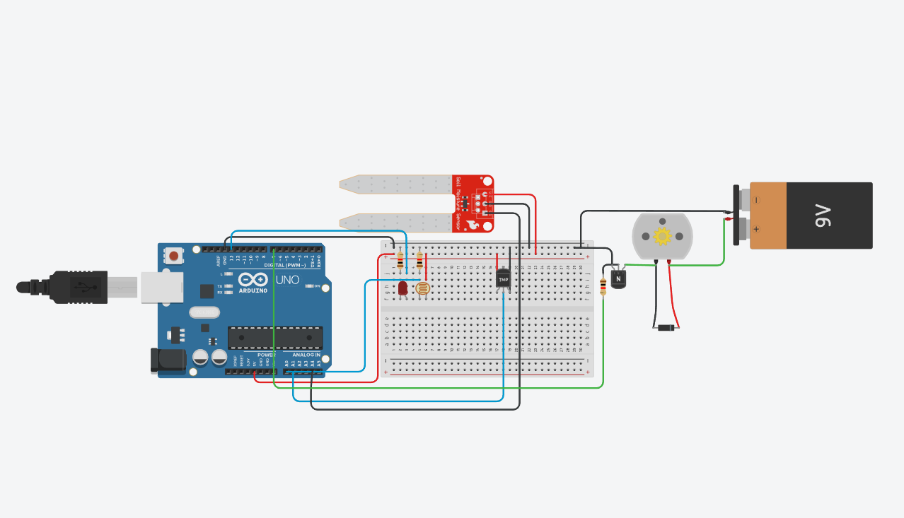

# 🌱 Estufa Automatizada para Hortaliças

Protótipo de estufa inteligente desenvolvido com **Arduino Uno** e simulado no **Tinkercad**, criado para o curso de Internet das Coisas (IoT) na **UNICEP**.

---

## ⚙️ Como Funciona

* 💧 **Irrigação Automática:** O sensor de umidade detecta solo seco e aciona a bomba d'água (motor DC) através de um transistor.
* 💡 **Iluminação Auxiliar:** O sensor LDR identifica baixa luminosidade e liga o LED para manter o ciclo de fotossíntese.
* 🌡️ **Controle de Temperatura:** Monitora o calor interno para acionar o resfriamento quando necessário, usando **histerese** para evitar oscilações rápidas.

---

## 🛠️ O que foi Utilizado

* **Microcontrolador:** Arduino Uno (C++)
* **Sensores:** Umidade do solo, Temperatura (TMP36) e Luminosidade (LDR)
* **Eletrônica e Atuadores:** Motor DC (bomba), LED, Transistor NPN, Diodo de proteção e Bateria 9V
* **Plataforma:** Autodesk Tinkercad

---

## 🧠 Aprendizados do Projeto

* **Programação Embarcada:** Leitura de portas analógicas/digitais e aplicação de histerese no código.
* **Eletrônica Básica:** Uso de transistor como chave para cargas maiores e diodo *flyback* contra picos de corrente.
* **IoT & Sustentabilidade:** Automação prática voltada para economia de água e agricultura urbana.

---

## 📁 Arquivos

* `estufa.ino`: Código-fonte para o Arduino.
* `Estufa-automatizada-ProjetoUNICEP.pdf`: Documentação com esquemáticos detalhados.
* `img/`: Esquema elétrico e componentes do circuito.
